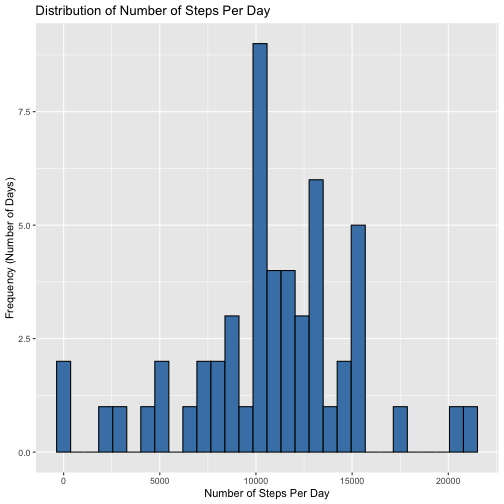
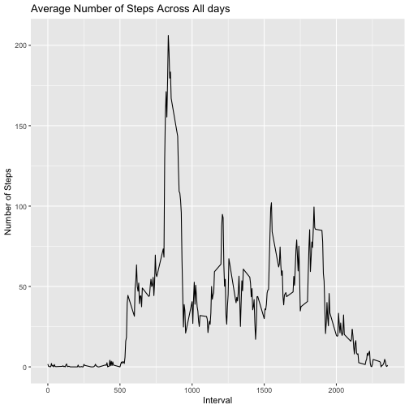
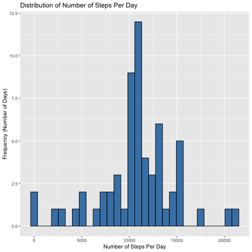
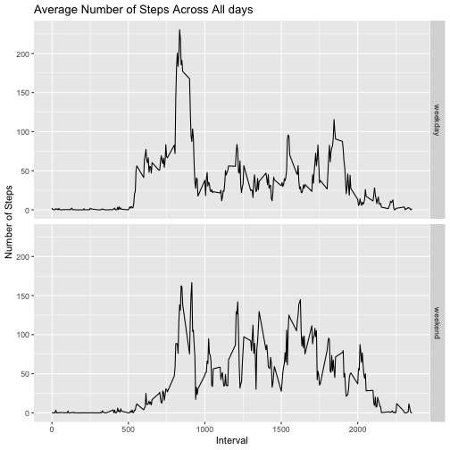

## Loading and preprocessing the data
Load the data named "activity.csv" that was stored in the working directory, and store it as ```act```.

``` r
act <- read.csv(file = "activity.csv", na.strings = "NA")
summary(act)
```

```
##      steps            date              interval     
##  Min.   :  0.00   Length:17568       Min.   :   0.0  
##  1st Qu.:  0.00   Class :character   1st Qu.: 588.8  
##  Median :  0.00   Mode  :character   Median :1177.5  
##  Mean   : 37.38                      Mean   :1177.5  
##  3rd Qu.: 12.00                      3rd Qu.:1766.2  
##  Max.   :806.00                      Max.   :2355.0  
##  NA's   :2304
```

Process the data into a format suitable for my analysis.

``` r
library(lubridate)
act$date <- ymd(act$date)
summary(act)
```

```
##      steps             date               interval     
##  Min.   :  0.00   Min.   :2012-10-01   Min.   :   0.0  
##  1st Qu.:  0.00   1st Qu.:2012-10-16   1st Qu.: 588.8  
##  Median :  0.00   Median :2012-10-31   Median :1177.5  
##  Mean   : 37.38   Mean   :2012-10-31   Mean   :1177.5  
##  3rd Qu.: 12.00   3rd Qu.:2012-11-15   3rd Qu.:1766.2  
##  Max.   :806.00   Max.   :2012-11-30   Max.   :2355.0  
##  NA's   :2304
```

## What is mean total number of steps taken per day?
Calculate the total number of steps taken each day, and stored the result in ```act_sum```.

``` r
library(dplyr)
act_sum <- act %>%
           group_by(date) %>%
           summarize(steps_sum = sum(steps))
summary(act_sum)
```

```
##       date              steps_sum    
##  Min.   :2012-10-01   Min.   :   41  
##  1st Qu.:2012-10-16   1st Qu.: 8841  
##  Median :2012-10-31   Median :10765  
##  Mean   :2012-10-31   Mean   :10766  
##  3rd Qu.:2012-11-15   3rd Qu.:13294  
##  Max.   :2012-11-30   Max.   :21194  
##                       NA's   :8
```

Make a histogram of the total number of steps taken each day.

``` r
library(ggplot2)
ggplot(act_sum, aes(x = steps_sum)) +
        geom_histogram(fill = "steelblue", color = "black") +
        labs(x = "Number of Steps Per Day", y = "Frequency (Number of Days)") +
        labs(title = "Distribution of Number of Steps Per Day")
```

```
## `stat_bin()` using `bins = 30`. Pick better value with `binwidth`.
```

```
## Warning: Removed 8 rows containing non-finite outside the scale range (`stat_bin()`).
```



Calculate the mean total number of steps taken per day.

``` r
meanValue <- mean(act_sum$steps_sum, na.rm = TRUE)
print(meanValue)
```

```
## [1] 10766.19
```

Calculate the median total number of steps taken per day.

``` r
medianValue <- median(act_sum$steps_sum, na.rm = TRUE)
print(medianValue)
```

```
## [1] 10765
```

## What is the average daily activity pattern?
Calculate the average number of steps taken of each 5-minute interval across all days, and store the result in ```act_mean```.

``` r
act_mean <- act %>%
            group_by(interval) %>%
            summarize(steps_mean = mean(steps, na.rm = TRUE))
summary(act_mean)
```

```
##     interval        steps_mean     
##  Min.   :   0.0   Min.   :  0.000  
##  1st Qu.: 588.8   1st Qu.:  2.486  
##  Median :1177.5   Median : 34.113  
##  Mean   :1177.5   Mean   : 37.383  
##  3rd Qu.:1766.2   3rd Qu.: 52.835  
##  Max.   :2355.0   Max.   :206.170
```

Make a time series plot (i.e. type = "l") of the 5-minute interval (x-axis) and the average number of steps taken, averaged across all days (y-axis)

``` r
ggplot(act_mean, aes(x = interval, y = steps_mean)) +
        geom_line() +
        labs(x = "Interval", y = "Number of Steps") +
        ggtitle("Average Number of Steps Across All days")
```



Calculate which 5-minute interval, on average across all the days in the dataset, contains the maximum number of steps?

``` r
act_mean$interval[which.max(act_mean$steps_mean)]
```

```
## [1] 835
```

## Imputing missing values
Calculate and report the total number of missing values in the dataset (i.e. the total number of rows with NAs).

``` r
sum(!complete.cases(act))
```

```
## [1] 2304
```

Create a new dataset ```act_filled``` with a new column ```steps_filled```, which is generated based on the original ```steps``` column by replacing the NA values with means of number of steps taken for their corresponding 5-minute intervals.

``` r
act_filled <- act %>%
              left_join(act_mean, by = "interval") %>%
              mutate(steps_filled = ifelse(is.na(steps), steps_mean, steps)) %>%
              select(-steps_mean)
summary(act_filled)
```

```
##      steps             date               interval       steps_filled   
##  Min.   :  0.00   Min.   :2012-10-01   Min.   :   0.0   Min.   :  0.00  
##  1st Qu.:  0.00   1st Qu.:2012-10-16   1st Qu.: 588.8   1st Qu.:  0.00  
##  Median :  0.00   Median :2012-10-31   Median :1177.5   Median :  0.00  
##  Mean   : 37.38   Mean   :2012-10-31   Mean   :1177.5   Mean   : 37.38  
##  3rd Qu.: 12.00   3rd Qu.:2012-11-15   3rd Qu.:1766.2   3rd Qu.: 27.00  
##  Max.   :806.00   Max.   :2012-11-30   Max.   :2355.0   Max.   :806.00  
##  NA's   :2304
```

Calculate the total number of steps taken each day (with the filled missing values), and store the result in ```act_filled_sum```.

``` r
act_filled_sum <- act_filled %>%
                  group_by(date) %>%
                  summarise(steps_filled_sum = sum(steps_filled))
```

Make a histogram of the total number of steps taken each day (with the filled missing values).

``` r
ggplot(act_filled_sum, aes(x = steps_filled_sum)) +
        geom_histogram(fill = "steelblue", color = "black") +
        labs(x = "Number of Steps Per Day", y = "Frequency (Number of Days)") +
        labs(title = "Distribution of Number of Steps Per Day")
```

```
## `stat_bin()` using `bins = 30`. Pick better value with `binwidth`.
```



Calculate the mean total number of steps taken per day. 

``` r
meanValueNAfilled <- mean(act_filled_sum$steps_filled_sum)
print(meanValueNAfilled)
```

```
## [1] 10766.19
```

Calculate the median total number of steps taken per day. 

``` r
medianValueNAfilled <- median(act_filled_sum$steps_filled_sum)
print(medianValueNAfilled)
```

```
## [1] 10766.19
```

What is the impact of imputing missing data on the estimates of the total daily number of steps? 
The mean total number of steps taken per day (after filled in missing values) is 1.0766189 &times; 10<sup>4</sup>, which is identical to the original result 1.0766189 &times; 10<sup>4</sup> where we ignored missing values. This showed that imputing missing data using mean values in this case does not impact the mean total number of steps taken per day.
The median total number of steps taken per day (after filled in missing values) is 1.0766189 &times; 10<sup>4</sup>, which is slightly larger than the original result 10765 where we ignored missing values.This showed that imputing missing data using mean values in this case slightly alters the mean total number of steps taken per day.


## Are there differences in activity patterns between weekdays and weekends?
Create a new factor variable in the dataset with two levels -- "weekday" and "weekend", and store the result in ```act_filled_day```

``` r
act_filled_day <- act_filled %>%
                  mutate(day_factors = weekdays(date)) %>%
                  mutate(day_factors = ifelse(day_factors %in% c("Saturday", "Sunday"), "weekend", "weekday"))
summary(act_filled_day)
```

```
##      steps             date               interval       steps_filled    day_factors       
##  Min.   :  0.00   Min.   :2012-10-01   Min.   :   0.0   Min.   :  0.00   Length:17568      
##  1st Qu.:  0.00   1st Qu.:2012-10-16   1st Qu.: 588.8   1st Qu.:  0.00   Class :character  
##  Median :  0.00   Median :2012-10-31   Median :1177.5   Median :  0.00   Mode  :character  
##  Mean   : 37.38   Mean   :2012-10-31   Mean   :1177.5   Mean   : 37.38                     
##  3rd Qu.: 12.00   3rd Qu.:2012-11-15   3rd Qu.:1766.2   3rd Qu.: 27.00                     
##  Max.   :806.00   Max.   :2012-11-30   Max.   :2355.0   Max.   :806.00                     
##  NA's   :2304
```


Calculate the average number of steps taken of each 5-minute interval separately for weekdays and weekends, and store the result in ```act_filled_day_mean```.

``` r
act_filled_day_mean <- act_filled_day %>%
                       group_by(day_factors, interval) %>%
                       summarise(steps_mean_day = mean(steps_filled))
```

```
## `summarise()` has grouped output by 'day_factors'. You can override using the `.groups` argument.
```

``` r
summary(act_filled_day_mean)
```

```
##  day_factors           interval      steps_mean_day   
##  Length:576         Min.   :   0.0   Min.   :  0.000  
##  Class :character   1st Qu.: 588.8   1st Qu.:  2.047  
##  Mode  :character   Median :1177.5   Median : 28.133  
##                     Mean   :1177.5   Mean   : 38.988  
##                     3rd Qu.:1766.2   3rd Qu.: 61.263  
##                     Max.   :2355.0   Max.   :230.378
```

Make a panel plot containing a time series plot (i.e. type = "l") of the 5-minute interval (x-axis) and the average number of steps taken, averaged across all weekday days or weekend days (y-axis).

``` r
ggplot(act_filled_day_mean, aes(x = interval, y = steps_mean_day)) +
        geom_line() +
        facet_grid(day_factors~.) +
        labs(x = "Interval", y = "Number of Steps") +
        labs(title = "Average Number of Steps Across All days")
```



There are at least to differences in activity patterns between weekdays and weekends.
First, during time interval 500-1000, generally speaking, the number of steps taken are higher on weekdays than on the weekend. Second, during time interval 1000-1500, the number of steps taken are lower on weekdays than on the weekend. These differences patterns reveals people have different activity or life style on weekdays and weekend.

